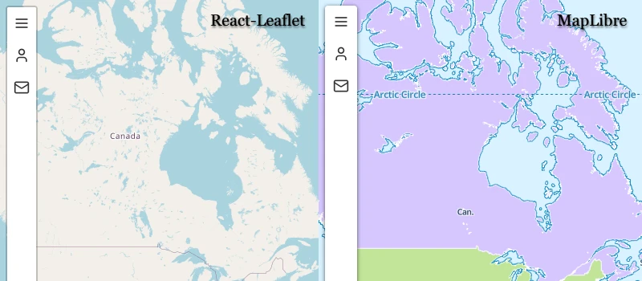

# React-Sidebar-v2




This is a React friendly port of [Turbo87's sidebar-v2](https://github.com/Turbo87/sidebar-v2) map control for React-Leaflet & MapLibre GL JS.

A big shoutout to Andreas Riedmüller for creating the [my-component-library](https://github.com/receter/my-component-library/tree/revision-1) scaffolding that this project leverages.
You can read his excellent overview article [here](https://dev.to/receter/how-to-create-a-react-component-library-using-vites-library-mode-4lma).

> NOTE: These components are in a pre-release stage, so the API will change drastically as it is being refined.

## Features
- Recreates all the original sidebar-v2 functionality (markup, events) in React (leverages the original CSS only)
- Includes the nifty map autopan functionality found in [Norwin's leaflet-sidebar-v2](https://github.com/noerw/leaflet-sidebar-v2).
- Includes both components for [React-Leaflet](https://react-leaflet.js.org/) and [MapLibre GL JS](https://maplibre.org/) libraries.
- Sidebar Context Provider for state manipulation from other React components
- Native [Lucide Icons](https://lucide.dev/) Integration
- TypeScript declarations

## Quick Start
1. Add `<SidebarProvider>` to a root component. This example uses 'maplibre' as type, but use 'leaflet' if that is
your library of choice.
```javascript
import { createRoot } from 'react-dom/client'
import App from './App.tsx'
import { BrowserRouter as Router } from 'react-router-dom';
import {StrictMode} from "react";
import {SidebarProvider} from "@bqtran/react-sidebar-v2";

createRoot(document.getElementById('root')!).render(
  <StrictMode>
    <SidebarProvider type="maplibre">
      <Router>
        <App />
      </Router>
    </SidebarProvider>
  </StrictMode>
)
```
2. Add either `ReactLeafletSidebar` or `MaplibreSidebar` to your map as a basic example is shown below:
### React-Leaflet Example
```javascript
import "leaflet/dist/leaflet.css"
import {ReactLeafletSidebar} from "@bqtran/react-sidebar-v2";
import {MapContainer, TileLayer} from 'react-leaflet'

export default function LeafletMap() {
  return <div style={{flex:"1 1 auto", height:"100vh", width:"100vw"}} >
      <MapContainer center={[29.648, -95.579]} zoom={13} scrollWheelZoom={false} zoomControl={false} style={{height:"100vh", width:"100vw"}}>
        <TileLayer
          attribution='&copy; <a href="https://www.openstreetmap.org/copyright">OpenStreetMap</a> contributors'
          url="https://{s}.tile.openstreetmap.org/{z}/{x}/{y}.png"
        />
        <ReactLeafletSidebar position="left" autopan={true} tabs={[
          {
            id: "menu",
            title:"Menu",
            icon:"Menu",
            position:"top",
            disabled:false,
            content:<p>Menu Content</p>
          },
          {
            id:"settings",
            title:"Settings",
            icon:"Settings",
            position:"bottom",
            disabled:false,
            content:<p>Settings Content</p>
          }
        ]}/>
      </MapContainer>
  </div>
}

```
>Note: `ReactLeafletSidebar` needs to be a child component of `MapContainer` for React-Leaflet's contexts to work properly.
### MapLibre GL JS Example
```javascript
import {MapLibreSidebar} from "@bqtran/react-sidebar-v2";
import maplibre from "maplibre-gl"
import "maplibre-gl/dist/maplibre-gl.css"
import {useEffect, useState} from "react"

export default function MapLibre() {
  const [map, setMap] = useState<maplibre.Map|undefined>(undefined);
  
  useEffect(() => {
    if(map == undefined) {
      setMap(new maplibre.Map({
        container: "map",
        zoom: 2,
        style: 'https://demotiles.maplibre.org/style.json'
      }));
    }
  }, []);

  return  <div style={{flex: "1 1 auto", height: "100vh", width: "100vw"}}>
            <div id="map" style={{height: "100vh", width: "100vw"}}/>
            {map && <MapLibreSidebar map={map} position="left" autopan={true} tabs={[
                {
                  id: "menu",
                  title: "Menu",
                  icon: "Menu",
                  position: "top",
                  disabled: false,
                  content: <p>Menu Content</p>
                },
                {
                  id: "settings",
                  title: "Settings",
                  icon: "Settings",
                  position: "bottom",
                  disabled: false,
                  content: <p>Settings Content</p>
                }
              ]} />
            }
          </div>
}

```
>Note: The `Map` component needs to exist before it can be passed to `MapLibreSidebar`, so useState is used for this purpose.

3. The sidebar should now be showing up on your map of choice.

## Advanced Usage
A Sidebar Context is provided to expose the Sidebar's API to other React components for state information and manipulation.
You can use this to dynamically style the Sidebar according to the current state. Below is an example that applies/removes
round corners to the sidebar depending on if a tab is expanded or collapsed:

```javascript
import "leaflet/dist/leaflet.css"
import {ReactLeafletSidebar, SidebarContext, SidebarContextType} from "@bqtran/react-sidebar-v2";
import {MapContainer, TileLayer} from 'react-leaflet'
import {useContext} from "react";

export default function LeafletMap() {
  const {collapsed} = useContext(SidebarContext) as SidebarContextType;
  
  return  <div style={{flex:"1 1 auto", height:"100vh", width:"100vw"}} >
            <MapContainer center={[29.648, -95.579]} zoom={13} scrollWheelZoom={false} zoomControl={false} style={{height:"100vh", width:"100vw"}}>
              <TileLayer
                attribution='&copy; <a href="https://www.openstreetmap.org/copyright">OpenStreetMap</a> contributors'
                url="https://{s}.tile.openstreetmap.org/{z}/{x}/{y}.png"
              />
              <ReactLeafletSidebar autopan={true} position="left" tabsClassName={`${collapsed ? 'rounded-lg':'rounded-l-lg'}`} contentsClassName="rounded-r-lg" tabs={[
                {
                  id: "menu",
                  title:"Menu",
                  icon:"Menu",
                  position:"top",
                  disabled:false,
                  content:<p>Menu Content</p>,
                  tabClassName: collapsed ? 'rounded-t-lg': 'rounded-tl-lg'
                },
                {
                  id:"settings",
                  title:"Settings",
                  icon:"Settings",
                  position:"bottom",
                  disabled:false,
                  content:<p>Settings Content</p>
                }
              ]}/>
            </MapContainer>
          </div>
}
```
## API

### [SidebarProvider] Context Provider Properties
- `type`: _String_ - Sidebar Type. Values: 'maplibre', 'leaflet'

### [SidebarContext] Context Provider Consumables
- `innerRef`: _React.Ref_ - Reference to Sidebar
- `activeTab/setActiveTab`: _String/React.SetStateAction_ - get/set current active tab ID
- `collapsed/setCollapsed`: _Boolean/React.SetStateAction_ - get/set Sidebar's expanded/collapsed state
- `positionRef`: _React.Ref<'left','right'>_ - Reference to Sidebar control's orientation on map
- `sidebarTabsRef`: _React.Ref<TabType[]>_ - Reference to Sidebar tabs
- `toggleTab`: _String_ - enable/disable tab by ID
- `type`: _String_ - get current Sidebar's configured type

### [ReactLeafletSidebar / MapLibreSidebar] Component Properties
- `className`: _String_ (Optional) - Sidebar container styling
- `tabsClassName`: _String_ (Optional) - Sidebar tab container styling
- `contentsClassName`: _String_ (Optional) - Sidebar tab content container styling
- `position`: _String_ - Sidebar control placement. Values: 'left', 'right'
- `autopan`: _Boolean_ - Pan map on Sidebar expand/collapse
- `tabs`: Tab[]- Array of Sidebar tabs
  - `id`: _String_ - tab unique identifier
  - `tabClassName`: _String_ (Optional) - individual tab styling
  - `contentClassName`: _String_ (Optional) - individual tab content styling
  - `title`: _String/Component_ - tab header text or component
  - `icon`: _String_ - icon name from [Lucide Icon](https://lucide.dev/) collection
  - `position`: _String_ - fix tab icon to 'top' or 'bottom'. Values: 'top', 'bottom'
  - `disabled`: _Boolean_ - disable/enable sidebar tab
  - `content`: _String/Component_ - tab content

### [ReactLeafletSidebar / MapLibreSidebar] Events
- `"closing"` : (_tab_id_) - close tab event triggered
- `"opening"` : (_tab_id_) - open tab event triggered
- `"content"` : (_tab_id_) - content event triggered

## Attributions
[Lucide](https://lucide.dev/) - [ISC License](https://lucide.dev/license)

[React-Leaflet](https://react-leaflet.js.org/) - [Hippocratic License](https://github.com/PaulLeCam/react-leaflet/blob/master/LICENSE.md)

[MapLibre](https://maplibre.org/) - [3-Clause BSD license](https://github.com/maplibre/maplibre-gl-js/blob/main/LICENSE.txt)